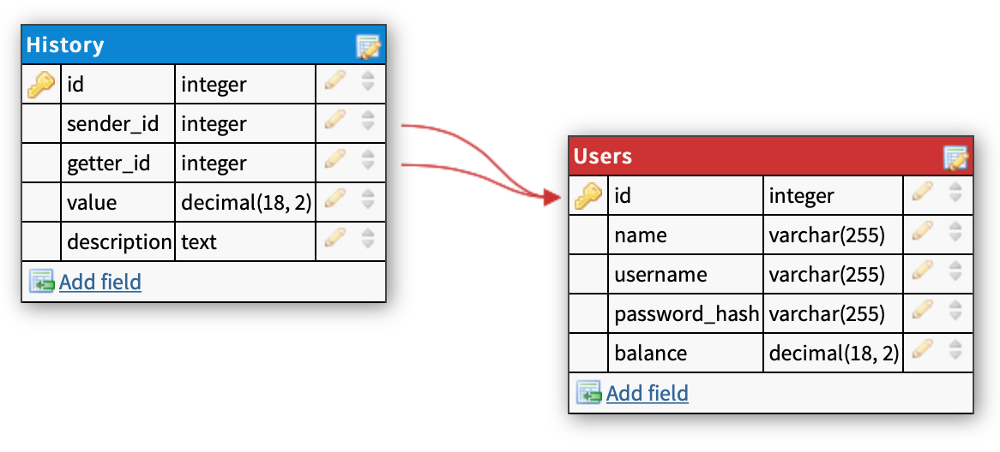

# User_balance 😎💰💸
A simple web server for managing user balances.
Implemented on Golang 1.19 using web framework Gin.

You can create users, log in and transfer money to other users or outside.  
Password data is hached, authorization is implemented using jwt tokens.

## Requirements:
Docker/docker-compose.

## How to start:
```bash
$ make run
```
This command will create two containers:
* PostreSQL on 5432 port
* API itself on 8000 port


To stop API type:
```bash
$ make stop
```
or
```bash
$ docker-compose down
```
## Supported requests:
```
POST    /auth/sign_up       :   Сreating a user and returns them ids
POST    /auth/sign_in       :   User authorization
POST    /api/single_pay     :   Transfering money outside and returns the id of the created operation
POST    /api/b2b_pay        :   Transfering money to another user and returns the id of the created operation
GET     /api/get_history    :   Returns records of all payments from and to the user
GET     /api/get_balance    :   Returns user's balance
```

## Db schema

I use PostgreSQL as a database in this project.


*Database schema illustration*
